# Google ADK to Microsoft Agent Framework Migration

This repository contains a side-by-side comparison of AI agent implementations using **Google ADK (Agent Development Kit)** and **Microsoft Agent Framework**.

## 📚 Original Source

The Google ADK examples in this repository are based on the excellent course materials from:

> **[pdichone/adk-course](https://github.com/pdichone/adk-course)** - Google Agent Development Kit (ADK) MasterClass
>
> All credit for the original ADK implementations goes to [@pdichone](https://github.com/pdichone).

---

## 📁 Repository Structure


---

## 🔄 Framework Comparison

### High-Level Mapping

| Concept | Google ADK | Microsoft Agent Framework |
|---------|------------|---------------------------|
| **Package** | `google-adk` | `agent-framework` |
| **Agent Class** | `Agent` / `LlmAgent` | `ChatCompletionAgent` |
| **Agent Callbacks** | `before_agent_callback` / `after_agent_callback` | `Middleware` class with `invoke()` |
| **Model Callbacks** | `before_model_callback` / `after_model_callback` | `Middleware` (return early to block) |
| **Sequential Agents** | `SequentialAgent` | `SequentialWorkflow` |
| **Parallel Agents** | `ParallelAgent` | `asyncio.gather()` |
| **Session Service** | `InMemorySessionService` / `DatabaseSessionService` | Custom implementation |
| **State Access** | `tool_context.state` | Global context / custom stores |
| **Runner** | `Runner` class | Direct `agent.invoke()` |
| **Structured Output** | `output_schema` + `output_key` | Pydantic + response parsing |
| **LLM Provider** | Google Gemini | Azure OpenAI / OpenAI |

### Architecture Comparison

```mermaid
flowchart TB
    subgraph Google["🔵 GOOGLE ADK"]
        G_Input["👤 User Input"]
        G_Runner["Runner<br/>(agent, session_service)"]
        G_BeforeAgent["before_agent_callback"]
        G_Agent["Agent"]
        G_AfterAgent["after_agent_callback"]
        G_BeforeModel["before_model_callback"]
        G_API["🤖 Gemini API"]
        G_AfterModel["after_model_callback"]
        G_Response["📤 Response<br/>(auto-stored via output_key)"]
        
        G_Input --> G_Runner
        G_Runner --> G_BeforeAgent
        G_BeforeAgent --> G_Agent
        G_Agent --> G_AfterAgent
        G_AfterAgent --> G_BeforeModel
        G_BeforeModel --> G_API
        G_API --> G_AfterModel
        G_AfterModel --> G_Response
    end
    
    subgraph Microsoft["🟢 MICROSOFT AGENT FRAMEWORK"]
        M_Input["👤 User Input"]
        M_Agent["ChatCompletionAgent<br/>.invoke(message, thread)"]
        M_Middleware["Middleware.invoke()"]
        M_Before["Before Logic"]
        M_Next["await next_handler()"]
        M_After["After Logic"]
        M_API["🤖 Azure OpenAI API"]
        M_Response["📤 Response<br/>(manual state management)"]
        
        M_Input --> M_Agent
        M_Agent --> M_Middleware
        M_Middleware --> M_Before
        M_Before --> M_Next
        M_Next --> M_API
        M_API --> M_After
        M_After --> M_Response
    end
```



### Multi-Agent Patterns


| Pattern | Google ADK | Microsoft Agent Framework |
|---------|------------|---------------------------|
| **Sequential** | `SequentialAgent(sub_agents=[...])` | `SequentialWorkflow` + manual chaining |
| **Parallel** | `ParallelAgent(sub_agents=[...])` | `asyncio.gather(*tasks)` |

### Callback/Middleware Flow


---

## 📋 Example Translations

### 1. Agent Callbacks

**Google ADK:**
```python
def before_agent_callback(callback_context):
    print(f"Processing: {callback_context.user_content}")
    return None

root_agent = LlmAgent(
    name="agent",
    before_agent_callback=before_agent_callback,
)
```

**Microsoft Agent Framework:**
```python
class TimingMiddleware(Middleware):
    async def invoke(self, context, next_handler):
        print(f"Processing: {context.input_message.content}")
        return await next_handler(context)

agent = ChatCompletionAgent(middleware=[TimingMiddleware()])
```

### 2. Sequential Agents

**Google ADK:**
```python
root_agent = SequentialAgent(
    name="Pipeline",
    sub_agents=[agent1, agent2, agent3],
)
```

**Microsoft Agent Framework:**
```python
class Pipeline(SequentialWorkflow):
    async def run(self, input):
        r1 = await self.agent1.invoke(input)
        r2 = await self.agent2.invoke(r1)
        return await self.agent3.invoke(r2)
```

### 3. Parallel Agents

**Google ADK:**
```python
root_agent = ParallelAgent(
    sub_agents=[agent1, agent2, agent3],
)
```

**Microsoft Agent Framework:**
```python
results = await asyncio.gather(
    agent1.invoke(input),
    agent2.invoke(input),
    agent3.invoke(input),
)
```

---

## 🚀 Getting Started

### Google ADK (adk folder)

```bash
cd adk
pip install uv
uv sync
uv run python agent-callback/agent.py
```

**Environment Variables:**
```bash
GOOGLE_API_KEY=your-google-api-key
```

### Microsoft Agent Framework (mfa folder)

```bash
cd mfa
pip install uv
uv sync
uv run python agent-callback/agent.py
```

**Environment Variables:**
```bash
AZURE_OPENAI_ENDPOINT=https://your-resource.openai.azure.com/
AZURE_OPENAI_API_KEY=your-api-key
AZURE_OPENAI_DEPLOYMENT=gpt-4o
```

---

## 📖 Detailed Analysis Documents

Each translated example includes an `ANALYSIS.md` file with:
- Detailed component mapping
- Mermaid diagrams for architecture visualization
- Code comparison examples
- Trade-offs and advantages

| Example | Analysis |
|---------|----------|
| Agent Callbacks | [mfa/agent-callback/ANALYSIS.md](mfa/agent-callback/ANALYSIS.md) |
| Model Callbacks | [mfa/model-callback/ANALYSIS.md](mfa/model-callback/ANALYSIS.md) |
| Multi-Agents | [mfa/multi-agents/ANALYSIS.md](mfa/multi-agents/ANALYSIS.md) |
| Parallel Agent | [mfa/parallel-agent/ANALYSIS.md](mfa/parallel-agent/ANALYSIS.md) |
| Persistent Agent | [mfa/persistent_agent/ANALYSIS.md](mfa/persistent_agent/ANALYSIS.md) |
| Session State Runner | [mfa/session-state-runner/ANALYSIS.md](mfa/session-state-runner/ANALYSIS.md) |

---

## 🔗 References

### Google ADK
- [Google ADK Documentation](https://google.github.io/adk-docs/)
- [Original Course Repository](https://github.com/pdichone/adk-course)

### Microsoft Agent Framework
- [Microsoft Agent Framework Overview](https://learn.microsoft.com/en-us/agent-framework/overview/agent-framework-overview)
- [Migration Guide from Semantic Kernel](https://learn.microsoft.com/en-us/agent-framework/migration/semantic-kernel)
- [Migration Guide from AutoGen](https://learn.microsoft.com/en-us/agent-framework/migration/autogen)

---

## ⚖️ Key Takeaways


| Aspect | Google ADK | Microsoft Agent Framework |
|--------|------------|---------------------------|
| **Philosophy** | Declarative, convention-over-configuration | Explicit, programmatic control |
| **Learning Curve** | Lower (more built-in features) | Moderate (more DIY) |
| **Flexibility** | Moderate | High |
| **Enterprise Features** | Good | Excellent |
| **Multi-Agent Patterns** | Built-in (`SequentialAgent`, `ParallelAgent`) | Workflows + `asyncio` |
| **State Management** | Automatic (sessions, events) | Manual (custom stores) |

---

## 📝 License

This translation work is provided for educational purposes. Please refer to the original repositories for their respective licenses:
- [pdichone/adk-course](https://github.com/pdichone/adk-course)
- [Microsoft Agent Framework](https://github.com/microsoft/agent-framework)

---

## 🙏 Acknowledgments

Special thanks to:
- **[@pdichone](https://github.com/pdichone)** for creating the original Google ADK course materials
- **Google** for the Agent Development Kit
- **Microsoft** for the Agent Framework
