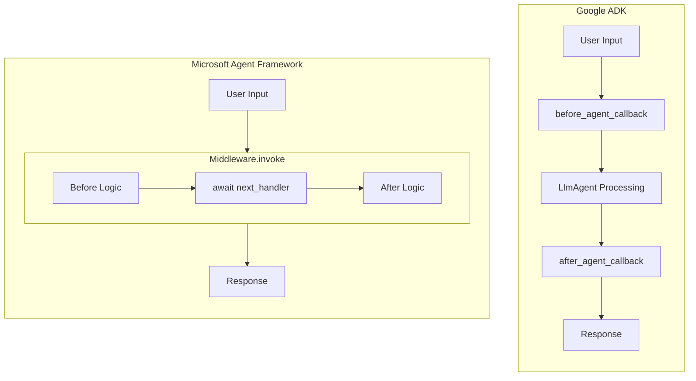
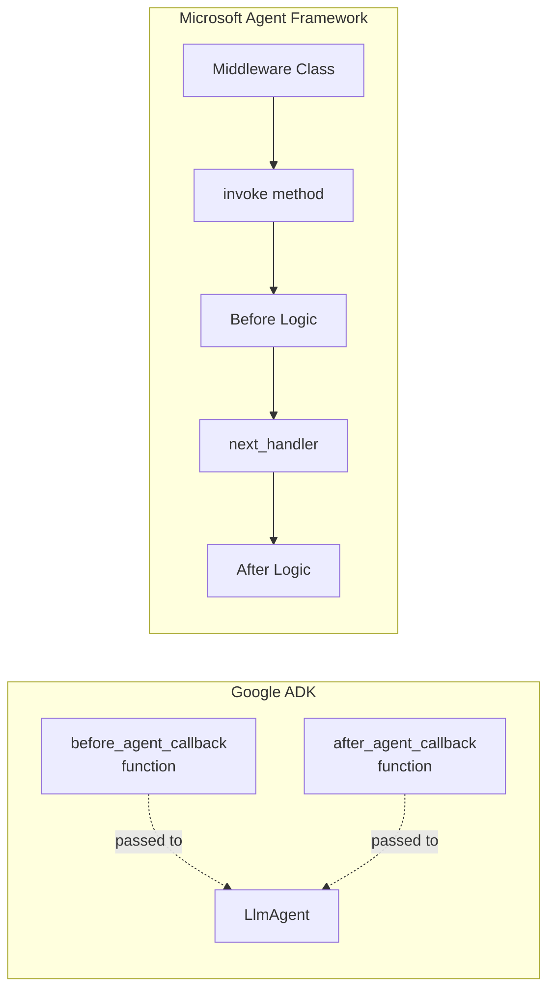
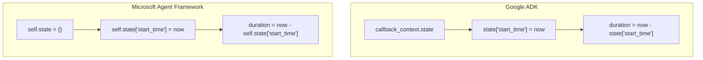
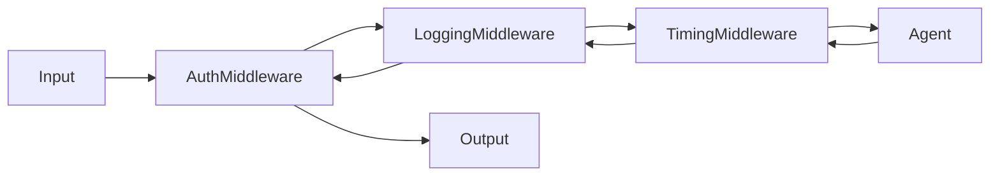
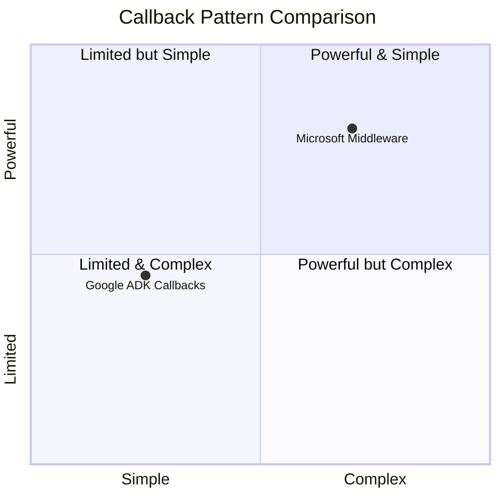

# Agent Callback Translation Analysis
## Google ADK → Microsoft Agent Framework

This document analyzes the translation of the agent-callback example from Google's Agent Development Kit (ADK) to Microsoft's Agent Framework.

---

## 📋 Overview

| Aspect | Google ADK | Microsoft Agent Framework |
|--------|------------|---------------------------|
| **Package** | `google-adk` | `agent-framework` |
| **Status** | Production | Public Preview |
| **Callback Pattern** | Separate functions | Middleware class |
| **State Management** | `CallbackContext.state` | `AgentThread` + Middleware state |
| **LLM Provider** | Google Gemini | Azure OpenAI / OpenAI |

---

## 🔄 Architectural Comparison

### High-Level Architecture



### Google ADK Approach

Google ADK uses a **declarative callback pattern** with two separate functions:

```python
def before_agent_callback(callback_context: CallbackContext) -> Optional[types.Content]:
    # Called BEFORE agent processes message
    return None  # Continue normal processing

def after_agent_callback(callback_context: CallbackContext) -> Optional[types.Content]:
    # Called AFTER agent generates response
    return None  # Don't modify response

root_agent = LlmAgent(
    name="math_tutor",
    before_agent_callback=before_agent_callback,
    after_agent_callback=after_agent_callback,
)
```

**Characteristics:**
- Simple function-based callbacks
- Passed directly to agent constructor
- Clear separation of before/after logic
- Return `None` to continue, or return content to override

### Microsoft Agent Framework Approach

Microsoft Agent Framework uses a **middleware pattern** with a class:

```python
class TimingMiddleware(Middleware):
    async def invoke(self, context, next_handler):
        # BEFORE: Code here runs before agent processes
        result = await next_handler(context)
        # AFTER: Code here runs after agent responds
        return result

agent = ChatCompletionAgent(middleware=[timing_middleware])
```

**Characteristics:**
- Object-oriented middleware class
- Single `invoke` method wraps entire call
- `next_handler()` acts as the dividing point
- Supports middleware chaining (multiple middleware in sequence)

---

## 📊 Detailed Mapping

### Component Mapping

| Google ADK Component | Microsoft Agent Framework Equivalent |
|---------------------|-------------------------------------|
| `LlmAgent` | `ChatCompletionAgent` |
| `before_agent_callback` | Code before `await next_handler(context)` |
| `after_agent_callback` | Code after `await next_handler(context)` |
| `CallbackContext` | `MiddlewareContext` |
| `CallbackContext.state` | Middleware instance state / `AgentThread` |
| `callback_context.user_content` | `context.input_message.content` |
| `types.Content` | Response object |
| `model="gemini-2.0-flash"` | `AzureOpenAIChatCompletionClient` |
| `instruction` | `system_prompt` |

### Import Mapping

| Google ADK Imports | Microsoft Agent Framework Imports |
|-------------------|----------------------------------|
| `from google.adk.agents import LlmAgent` | `from agent_framework import ChatCompletionAgent` |
| `from google.adk.agents.callback_context import CallbackContext` | `from agent_framework.middleware import Middleware, MiddlewareContext` |
| `from google.genai import types` | Built into response objects |
| N/A | `from agent_framework import AgentThread` |
| N/A | `from agent_framework.models import AzureOpenAIChatCompletionClient` |

---

## 🔑 Key Differences

### 1. Callback Structure



**Google ADK:**
- Two separate functions with clear responsibilities
- Each function receives `CallbackContext`
- Functions are passed as constructor parameters

**Microsoft Agent Framework:**
- Single `Middleware` class with `invoke` method
- `next_handler()` separates before/after logic
- Middleware instances added to a list

### 2. State Management



**Google ADK:**
```python
# Store in callback context state
callback_context.state["start_time"] = datetime.now()

# Retrieve later
if "start_time" in callback_context.state:
    duration = datetime.now() - callback_context.state["start_time"]
```

**Microsoft Agent Framework:**
```python
class TimingMiddleware(Middleware):
    def __init__(self):
        self.state = {}  # Instance-level state
    
    async def invoke(self, context, next_handler):
        self.state["start_time"] = datetime.now()
        result = await next_handler(context)
        duration = datetime.now() - self.state["start_time"]
        return result
```

### 3. Async/Sync Pattern

**Google ADK:**
- Callbacks are synchronous functions
- Return `Optional[types.Content]`

**Microsoft Agent Framework:**
- Middleware is always async (`async def invoke`)
- Must `await next_handler(context)`
- Returns the result from `next_handler`

### 4. Response Modification

**Google ADK:**
```python
def after_agent_callback(callback_context):
    # Return None to keep original response
    return None
    # Or return modified content
    return types.Content(parts=[types.Part(text="Modified response")])
```

**Microsoft Agent Framework:**
```python
async def invoke(self, context, next_handler):
    result = await next_handler(context)
    # Return result as-is to keep original
    return result
    # Or modify and return
    result.content = "Modified response"
    return result
```

### 5. Middleware Chaining



**Google ADK:**
- Single before/after callback per agent
- No built-in chaining mechanism

**Microsoft Agent Framework:**
- Multiple middleware can be chained
- Each middleware calls `next_handler` to pass to next middleware

```python
agent = ChatCompletionAgent(
    middleware=[
        AuthMiddleware(),      # First
        LoggingMiddleware(),   # Second
        TimingMiddleware(),    # Third
    ]
)
```

---

## 🌐 Environment Configuration

### Google ADK

```bash
# Google AI credentials
GOOGLE_API_KEY=your-google-api-key
```

### Microsoft Agent Framework

```bash
# Azure OpenAI credentials
AZURE_OPENAI_ENDPOINT=https://your-resource.openai.azure.com/
AZURE_OPENAI_API_KEY=your-api-key
AZURE_OPENAI_DEPLOYMENT=gpt-4o

# Or OpenAI directly
OPENAI_API_KEY=your-openai-key
```

---

## ✅ Advantages & Trade-offs



### Google ADK Advantages
- ✅ Simpler, more intuitive callback pattern
- ✅ Clear separation of before/after responsibilities
- ✅ Less boilerplate code
- ✅ Direct access to Google's Gemini models

### Microsoft Agent Framework Advantages
- ✅ Middleware chaining for complex pipelines
- ✅ Object-oriented design with encapsulated state
- ✅ Unified framework combining Semantic Kernel + AutoGen
- ✅ Enterprise features (telemetry, type safety)
- ✅ Graph-based workflows for multi-agent orchestration
- ✅ Better support for long-running processes

### Trade-offs

| Aspect | Google ADK | Microsoft Agent Framework |
|--------|------------|---------------------------|
| Learning Curve | Lower | Moderate |
| Flexibility | Moderate | Higher |
| Boilerplate | Less | More |
| Enterprise Features | Basic | Comprehensive |
| Multi-Agent Support | Good | Excellent |

---

## 🔗 References

- [Microsoft Agent Framework Overview](https://learn.microsoft.com/en-us/agent-framework/overview/agent-framework-overview)
- [Google ADK Documentation](https://google.github.io/adk-docs/)
- [Semantic Kernel Migration Guide](https://learn.microsoft.com/en-us/agent-framework/migration/semantic-kernel)
- [AutoGen Migration Guide](https://learn.microsoft.com/en-us/agent-framework/migration/autogen)

---

## 📝 Notes

> **Important:** Microsoft Agent Framework is currently in **public preview**. The API may change before general availability. Always refer to the official documentation for the latest API specifications.

The middleware pattern in Microsoft Agent Framework is more powerful but requires understanding of async/await patterns and object-oriented design. For simple use cases, Google ADK's callback functions may be more straightforward, while Microsoft Agent Framework excels in complex enterprise scenarios requiring middleware chaining, telemetry, and multi-agent workflows.
