# Model Callback Translation Analysis
## Google ADK → Microsoft Agent Framework

This document analyzes the translation of the model-callback example from Google's Agent Development Kit (ADK) to Microsoft's Agent Framework.

---

## 📋 Overview

Model callbacks intercept the **actual LLM API calls**, operating at a lower level than agent callbacks.

| Aspect | Google ADK | Microsoft Agent Framework |
|--------|------------|---------------------------|
| **Callback Level** | Model/LLM API level | Middleware pattern |
| **Request Interception** | `before_model_callback` | Code before `next_handler()` |
| **Response Modification** | `after_model_callback` | Code after `next_handler()` |
| **Request Blocking** | Return `LlmResponse` | Return without calling `next_handler()` |
| **Continue Processing** | Return `None` | Call `await next_handler(context)` |

---

## 🔄 Agent Callbacks vs Model Callbacks

Understanding the difference is crucial:


| Callback Type | When It Runs | Use Cases |
|---------------|--------------|-----------|
| **Agent Callbacks** | Before/after agent processes message | Logging, timing, authentication |
| **Model Callbacks** | Before/after actual LLM API call | Content filtering, response modification, blocking |

---

## 📊 Detailed Mapping

### Component Mapping

| Google ADK | Microsoft Agent Framework |
|------------|---------------------------|
| `before_model_callback(context, llm_request)` | Middleware code before `next_handler()` |
| `after_model_callback(context, llm_response)` | Middleware code after `next_handler()` |
| `LlmRequest` | `ChatCompletionRequest` / `context.input_message` |
| `LlmResponse` | `ChatCompletionResponse` / `result` |
| `llm_request.contents` | `context.input_message.content` |
| `llm_response.content.parts[0].text` | `result.content` |
| Return `LlmResponse` (block) | Return early without `next_handler()` |
| Return `None` (continue) | `await next_handler(context)` |

### Data Flow Comparison

**Google ADK:**
```python
def before_model_callback(callback_context, llm_request) -> Optional[LlmResponse]:
    # Access request data
    user_message = llm_request.contents[0].parts[0].text
    
    # Block by returning a response
    if should_block(user_message):
        return LlmResponse(
            content=types.Content(
                role="model",
                parts=[types.Part(text="Blocked!")]
            )
        )
    
    return None  # Continue to model
```

**Microsoft Agent Framework:**
```python
async def invoke(self, context, next_handler):
    # Access request data
    user_message = context.input_message.content
    
    # Block by returning early
    if should_block(user_message):
        return BlockedResponse("Blocked!")
    
    # Continue to model
    return await next_handler(context)
```

---

## 🔑 Key Differences

### 1. Request Blocking Pattern


**Google ADK** - Return a response object to block:
```python
def before_model_callback(context, request):
    if is_blocked:
        return LlmResponse(
            content=types.Content(
                role="model",
                parts=[types.Part(text="Blocked message")]
            )
        )
    return None  # Continue
```

**Microsoft Agent Framework** - Return without calling next_handler:
```python
async def invoke(self, context, next_handler):
    if is_blocked:
        # Don't call next_handler - return custom response
        return self._create_blocked_response("Blocked message")
    
    # Continue to model
    return await next_handler(context)
```

### 2. Response Modification Pattern


**Google ADK:**
```python
def after_model_callback(context, llm_response):
    original = llm_response.content.parts[0].text
    modified = original + " 🤖"
    
    return LlmResponse(
        content=types.Content(role="model", parts=[types.Part(text=modified)])
    )
```

**Microsoft Agent Framework:**
```python
async def invoke(self, context, next_handler):
    result = await next_handler(context)  # Get model response
    
    # Modify the response
    original = result.content
    result.content = original + " 🤖"
    
    return result
```

### 3. Request Data Access

**Google ADK:**
```python
# Access through LlmRequest
user_message = ""
if llm_request.contents:
    for content in llm_request.contents:
        if content.role == "user" and content.parts:
            user_message = content.parts[0].text
```

**Microsoft Agent Framework:**
```python
# Access through MiddlewareContext
user_message = context.input_message.content or ""
```

### 4. Response Structure

**Google ADK:**
```python
# Nested structure with Content and Parts
LlmResponse(
    content=types.Content(
        role="model",
        parts=[types.Part(text="Response text")]
    )
)
```

**Microsoft Agent Framework:**
```python
# Flatter structure
response.content = "Response text"
response.role = "assistant"
```

---

## 🛡️ Content Filtering Example

The example demonstrates blocking math-related queries:

### Keywords Blocked
```python
MATH_KEYWORDS = [
    "math", "calculate", "+", "-", "*", "/", "=",
    "plus", "minus", "times", "divided"
]
```

### Flow Diagram

```mermaid
flowchart TD
    subgraph BlockedFlow["Blocked Request Flow"]
        B_User["👤 User: 'What's 2+2?'"]
        B_Before["🔍 before_model_callback"]
        B_Check{"Contains math<br/>keywords?"}
        B_Block["🚫 BLOCKED"]
        B_Response["📝 'Sorry, I can't help<br/>with math problems...'"]
        
        B_User --> B_Before
        B_Before --> B_Check
        B_Check -->|"Yes (+)"| B_Block
        B_Block --> B_Response
    end
    
    subgraph AllowedFlow["Allowed Request Flow"]
        A_User["👤 User: 'Hello!'"]
        A_Before["🔍 before_model_callback"]
        A_Check{"Contains math<br/>keywords?"}
        A_Allow["✅ ALLOWED"]
        A_Model["🤖 LLM API Call"]
        A_After["🔍 after_model_callback"]
        A_Modify["✨ Add emoji"]
        A_Response["📝 'Hi there! 🤖'"]
        
        A_User --> A_Before
        A_Before --> A_Check
        A_Check -->|"No"| A_Allow
        A_Allow --> A_Model
        A_Model --> A_After
        A_After --> A_Modify
        A_Modify --> A_Response
    end
    
    style B_Block fill:#ffcdd2
    style A_Allow fill:#c8e6c9
    style B_Response fill:#fff3e0
    style A_Response fill:#e8f5e9
```



---

## ✅ Practical Use Cases


| Use Case | before_model | after_model |
|----------|--------------|-------------|
| **Content Filtering** | ✅ Block inappropriate requests | ✅ Filter inappropriate responses |
| **PII Detection** | ✅ Redact before sending | ✅ Redact in responses |
| **Rate Limiting** | ✅ Block excessive requests | |
| **Logging** | ✅ Log requests | ✅ Log responses |
| **Cost Control** | ✅ Block expensive queries | |
| **Response Enhancement** | | ✅ Add disclaimers/emojis |
| **Response Caching** | ✅ Return cached response | ✅ Cache new responses |
| **A/B Testing** | ✅ Route to different models | ✅ Track response metrics |

---

## 🌐 Environment Configuration

### Google ADK
```bash
GOOGLE_API_KEY=your-google-api-key
```

### Microsoft Agent Framework
```bash
AZURE_OPENAI_ENDPOINT=https://your-resource.openai.azure.com/
AZURE_OPENAI_API_KEY=your-api-key
AZURE_OPENAI_DEPLOYMENT=gpt-4o
```

---

## ✅ Summary


| Feature | Google ADK | Microsoft Agent Framework |
|---------|------------|---------------------------|
| **Blocking Pattern** | Return `LlmResponse` | Return without `next_handler()` |
| **Continue Pattern** | Return `None` | `await next_handler(context)` |
| **Response Modify** | Return new `LlmResponse` | Modify `result` object |
| **Data Access** | Nested parts structure | Flatter context structure |
| **Async Support** | Sync functions | Async required |

The key insight is that Microsoft Agent Framework uses a **unified middleware pattern** where:
- **Not calling** `next_handler()` = blocking (equivalent to returning `LlmResponse` in before_model_callback)
- **Calling** `next_handler()` = continue to model (equivalent to returning `None`)
- **Modifying result** after `next_handler()` = response modification (equivalent to after_model_callback)

---

## 🔗 References

- [Microsoft Agent Framework Overview](https://learn.microsoft.com/en-us/agent-framework/overview/agent-framework-overview)
- [Google ADK Documentation](https://google.github.io/adk-docs/)
