# Multi-Agent Translation Analysis
## Google ADK → Microsoft Agent Framework

This document analyzes the translation of the multi-agent travel planning system from Google's Agent Development Kit (ADK) to Microsoft's Agent Framework.

---

## 📋 Overview

This example demonstrates **multi-agent orchestration** - multiple specialized agents working together in sequence to complete a complex task.

| Aspect | Google ADK | Microsoft Agent Framework |
|--------|------------|---------------------------|
| **Orchestration** | `SequentialAgent` | `SequentialWorkflow` |
| **Sub-agents** | `sub_agents=[]` | `add_agent()` method |
| **Data Passing** | `output_key` | Workflow state/context |
| **Tools** | `tools=[google_search]` | `tools=[WebSearchTool()]` |
| **Base Agent** | `Agent` | `ChatCompletionAgent` |

---

## 🏗️ Architecture Comparison

### High-Level Architecture


### Google ADK Sequential Pattern

```python
# Individual agents with output_key for data passing
agent1 = Agent(
    name="ResearchAgent",
    output_key="research",  # Stores output for next agent
    tools=[google_search],
    ...
)

agent2 = Agent(
    name="BuilderAgent", 
    output_key="itinerary",  # Uses "research", stores "itinerary"
    ...
)

# Sequential orchestration
root_agent = SequentialAgent(
    name="System",
    sub_agents=[agent1, agent2, agent3],
)
```

### Microsoft Agent Framework Sequential Pattern

```python
# Individual agents (output handled via workflow state)
agent1 = ChatCompletionAgent(
    name="ResearchAgent",
    tools=[WebSearchTool()],
    ...
)

agent2 = ChatCompletionAgent(
    name="BuilderAgent",
    ...
)

# Sequential workflow orchestration
class MyWorkflow(SequentialWorkflow):
    def __init__(self):
        self.add_agent(agent1)
        self.add_agent(agent2)
        self.add_agent(agent3)
    
    async def run(self, input):
        state = {}  # Manual state management
        state["research"] = await agent1.invoke(...)
        state["itinerary"] = await agent2.invoke(state["research"])
        return await agent3.invoke(state["itinerary"])
```

---

## 📊 Detailed Mapping

### Component Mapping

| Google ADK | Microsoft Agent Framework |
|------------|---------------------------|
| `SequentialAgent` | `SequentialWorkflow` |
| `Agent` | `ChatCompletionAgent` |
| `sub_agents=[...]` | `add_agent()` / `agents=[]` |
| `output_key="key"` | Workflow state dictionary |
| `instruction` | `system_prompt` |
| `model="gemini-2.0-flash"` | `model_client=AzureOpenAIChatCompletionClient()` |
| `google_search` tool | `WebSearchTool()` |
| `tools=[func]` | `tools=[tool_instance]` |
| Auto data passing | Manual state management |

### Tool Decorator Mapping

**Google ADK:**
```python
from google.adk.tools import google_search

# Tools are just functions
def my_tool(arg: str) -> dict:
    return {"result": "..."}

Agent(tools=[google_search, my_tool])
```

**Microsoft Agent Framework:**
```python
from agent_framework.tools import tool, WebSearchTool

@tool
def my_tool(arg: str) -> dict:
    return {"result": "..."}

ChatCompletionAgent(tools=[WebSearchTool(), my_tool])
```

---

## 🔄 Data Flow Comparison

### Google ADK - Automatic with output_key

```mermaid
flowchart TD
    Input["👤 User Input<br/>'Plan trip to Tokyo'"]
    
    Input --> Agent1
    
    subgraph Agent1["🔍 Agent 1"]
        A1_Name["DestinationResearchAgent"]
        A1_Key["output_key = 'research'"]
        A1_Action["Researches destination"]
    end
    
    Agent1 -->|"automatic<br/>passes 'research'"| Agent2
    
    subgraph Agent2["📅 Agent 2"]
        A2_Name["ItineraryBuilderAgent"]
        A2_Key["output_key = 'itinerary'"]
        A2_Action["Reads 'research' automatically"]
    end
    
    Agent2 -->|"automatic<br/>passes 'itinerary'"| Agent3
    
    subgraph Agent3["⚡ Agent 3"]
        A3_Name["TravelOptimizerAgent"]
        A3_Action["Reads 'itinerary' automatically"]
    end
    
    Agent3 --> Output["📋 Final Travel Plan"]
    
    style Input fill:#e1f5fe
    style Output fill:#c8e6c9
```



### Microsoft Agent Framework - Explicit State Management


---

## 🔑 Key Differences

### 1. Orchestration Pattern

**Google ADK** - Declarative:
```python
root_agent = SequentialAgent(
    sub_agents=[agent1, agent2, agent3],
)
# Framework handles execution order and data passing
```

**Microsoft Agent Framework** - Programmatic:
```python
class MyWorkflow(SequentialWorkflow):
    async def run(self, input):
        # Developer controls execution and data flow
        r1 = await self.agent1.invoke(input)
        r2 = await self.agent2.invoke(r1)
        return await self.agent3.invoke(r2)
```

### 2. Data Passing Between Agents

**Google ADK** - Automatic via output_key:
```python
Agent(output_key="research")  # Framework stores & passes data
```

**Microsoft Agent Framework** - Manual via state:
```python
state["research"] = result.content  # Developer manages state
next_prompt = f"Using: {state['research']}"
```

### 3. Tool Registration

**Google ADK:**
```python
from google.adk.tools import google_search

Agent(tools=[google_search])  # Built-in tool
```

**Microsoft Agent Framework:**
```python
from agent_framework.tools import WebSearchTool

ChatCompletionAgent(tools=[WebSearchTool()])  # Tool instance
```

### 4. Custom Tools

**Google ADK:**
```python
def my_tool(city: str) -> dict:
    """Tool docstring becomes description."""
    return {"result": "..."}

Agent(tools=[my_tool])
```

**Microsoft Agent Framework:**
```python
from agent_framework.tools import tool

@tool
def my_tool(city: str) -> dict:
    """Tool docstring becomes description."""
    return {"result": "..."}

ChatCompletionAgent(tools=[my_tool])
```

---

## 🌐 Multi-Agent Patterns Comparison


| Pattern | Google ADK | Microsoft Agent Framework |
|---------|------------|---------------------------|
| **Sequential** | `SequentialAgent` | `SequentialWorkflow` |
| **Parallel** | `ParallelAgent` | `ParallelWorkflow` / concurrent execution |
| **Conditional** | Custom routing | Workflow edges with conditions |
| **Hand-off** | Agent delegation | `HandoffPattern` |
| **Group Chat** | N/A | `AgentGroupChat` |

---

## 🏢 Travel Planning System Components

### Agents in the System

| Agent | Role | Tools |
|-------|------|-------|
| **DestinationResearchAgent** | Research destinations | WebSearchTool |
| **ItineraryBuilderAgent** | Create day-by-day schedule | None |
| **TravelOptimizerAgent** | Add practical tips | None |

### Execution Flow

```mermaid
flowchart TD
    User["👤 User<br/>'Plan 5-day trip to Tokyo'"]
    
    User --> DR
    
    subgraph DR["📍 Destination Research Agent"]
        DR_Tool["🔍 WebSearchTool"]
        DR_Out["Output:<br/>• Weather patterns<br/>• Top attractions<br/>• Local customs<br/>• Transportation"]
    end
    
    DR -->|"state['destination_research']"| IB
    
    subgraph IB["📅 Itinerary Builder Agent"]
        IB_Out["Output:<br/>• Day-by-day schedule<br/>• Accommodation areas<br/>• Time estimates<br/>• Meal suggestions<br/>• Budget estimates"]
    end
    
    IB -->|"state['travel_itinerary']"| TO
    
    subgraph TO["⚡ Travel Optimizer Agent"]
        TO_Out["Output:<br/>• Money-saving tips<br/>• Packing list<br/>• Backup plans<br/>• Local apps/resources<br/>• Cultural tips"]
    end
    
    TO --> Final
    
    subgraph Final["📋 Complete Travel Plan"]
        F1["✅ ITINERARY"]
        F2["💰 OPTIMIZATION TIPS"]
        F3["🎒 TRAVEL ESSENTIALS"]
        F4["🔄 BACKUP PLANS"]
    end
    
    style User fill:#e3f2fd
    style Final fill:#e8f5e9
    style DR fill:#fff3e0
    style IB fill:#fce4ec
    style TO fill:#f3e5f5
```



---

## ✅ Advantages & Trade-offs

### Google ADK Advantages
- ✅ Simpler declarative syntax
- ✅ Automatic data passing via `output_key`
- ✅ Less boilerplate for sequential patterns
- ✅ Built-in Google Search integration

### Microsoft Agent Framework Advantages
- ✅ More control over execution flow
- ✅ Graph-based workflows for complex patterns
- ✅ Better support for conditional routing
- ✅ Checkpointing for long-running processes
- ✅ Human-in-the-loop scenarios
- ✅ More flexible state management

### Trade-offs


| Aspect | Google ADK | Microsoft Agent Framework |
|--------|------------|---------------------------|
| **Simplicity** | Higher | Moderate |
| **Flexibility** | Moderate | Higher |
| **Data Passing** | Automatic | Manual |
| **Complex Workflows** | Limited | Excellent |
| **Debugging** | Implicit flow | Explicit flow |

---

## 🌐 Environment Configuration

### Google ADK
```bash
GOOGLE_API_KEY=your-google-api-key
```

### Microsoft Agent Framework
```bash
AZURE_OPENAI_ENDPOINT=https://your-resource.openai.azure.com/
AZURE_OPENAI_API_KEY=your-api-key
AZURE_OPENAI_DEPLOYMENT=gpt-4o

# For web search (if using Bing)
BING_SEARCH_API_KEY=your-bing-key
```

---

## 📝 Summary

The key insight is that Google ADK's `SequentialAgent` with `output_key` provides a **declarative, automatic** approach to multi-agent orchestration, while Microsoft Agent Framework's `SequentialWorkflow` provides a **programmatic, explicit** approach.


| Feature | Google ADK | Microsoft Agent Framework |
|---------|------------|---------------------------|
| **Define sequence** | `sub_agents=[]` | `add_agent()` |
| **Pass data** | `output_key` (auto) | State dict (manual) |
| **Run workflow** | Automatic | `await workflow.run()` |
| **Access previous output** | Implicit in prompt | Explicit via state |

Microsoft's approach requires more code but offers:
- Full control over data transformation between agents
- Ability to add conditional logic mid-workflow
- Better observability and debugging
- Support for checkpointing and recovery

---

## 🔗 References

- [Microsoft Agent Framework Overview](https://learn.microsoft.com/en-us/agent-framework/overview/agent-framework-overview)
- [Microsoft Agent Framework Workflows](https://learn.microsoft.com/en-us/agent-framework/workflows)
- [Google ADK Multi-Agent Documentation](https://google.github.io/adk-docs/)
