# Parallel Agent Translation Analysis
## Google ADK → Microsoft Agent Framework

This document analyzes the translation of the parallel agent content creation system from Google's Agent Development Kit (ADK) to Microsoft's Agent Framework.

---

## 📋 Overview

This example demonstrates **parallel agent execution** - multiple specialized agents running concurrently on the same input to produce complementary outputs.

| Aspect | Google ADK | Microsoft Agent Framework |
|--------|------------|---------------------------|
| **Orchestration** | `ParallelAgent` | `ParallelWorkflow` / `asyncio.gather()` |
| **Sub-agents** | `sub_agents=[]` | Agents list + concurrent invoke |
| **Execution** | Automatic parallel | Explicit `asyncio.gather()` |
| **Result Collection** | `output_key` per agent | Results dataclass / dict |
| **Input Distribution** | Automatic (same input to all) | Explicit (pass to each agent) |

---

## 🏗️ Architecture Comparison

### High-Level Architecture


### Sequential vs Parallel Execution


**Time savings:** Parallel execution completes in ~5 units vs ~25 units for sequential!

---

## 📊 Detailed Mapping

### Component Mapping

| Google ADK | Microsoft Agent Framework |
|------------|---------------------------|
| `ParallelAgent` | `ParallelWorkflow` / `asyncio.gather()` |
| `Agent` | `ChatCompletionAgent` |
| `sub_agents=[...]` | Agents list + `asyncio.gather(*tasks)` |
| `output_key="key"` | Results dataclass / dict key |
| `instruction` | `system_prompt` |
| `google_search` | `WebSearchTool()` |
| Automatic input distribution | Explicit: same input to each agent |
| Automatic result collection | Manual: collect from gather results |

### Code Pattern Comparison

**Google ADK - Declarative:**
```python
root_agent = ParallelAgent(
    name="ContentSystem",
    sub_agents=[
        Agent(name="Blog", output_key="blog_content", ...),
        Agent(name="SEO", output_key="seo_strategy", ...),
        Agent(name="Visual", output_key="visual_content", ...),
    ],
)
# Framework handles parallel execution automatically
```

**Microsoft Agent Framework - Explicit:**
```python
class ContentSystem(ParallelWorkflow):
    async def run(self, input):
        tasks = [
            self._run_agent(self.blog_agent, input, "blog_content"),
            self._run_agent(self.seo_agent, input, "seo_strategy"),
            self._run_agent(self.visual_agent, input, "visual_content"),
        ]
        results = await asyncio.gather(*tasks)
        return ParallelResults(**results)
```

---

## 🔄 Data Flow Comparison

### Google ADK - Automatic Parallel Distribution

```mermaid
flowchart TD
    Input["👤 User Input<br/>'sustainable fashion'"]
    
    Input --> PA[ParallelAgent]
    
    PA ==>|"Same input<br/>(automatic)"| A1["📝 Blog Agent"]
    PA ==>|"Same input<br/>(automatic)"| A2["🔍 SEO Agent"]
    PA ==>|"Same input<br/>(automatic)"| A3["🎨 Visual Agent"]
    PA ==>|"Same input<br/>(automatic)"| A4["📱 Social Agent"]
    PA ==>|"Same input<br/>(automatic)"| A5["📧 Email Agent"]
    
    A1 -->|"output_key='blog_content'"| Results
    A2 -->|"output_key='seo_strategy'"| Results
    A3 -->|"output_key='visual_content'"| Results
    A4 -->|"output_key='social_strategy'"| Results
    A5 -->|"output_key='email_campaigns'"| Results
    
    Results["📊 Combined Results<br/>All outputs collected"]
    
    style PA fill:#e3f2fd
    style Results fill:#c8e6c9
```



### Microsoft Agent Framework - Explicit asyncio.gather

```mermaid
flowchart TD
    Input["👤 User Input<br/>'sustainable fashion'"]
    
    Input --> Workflow["ParallelWorkflow.run()"]
    
    subgraph Tasks["asyncio.gather(*tasks)"]
        T1["Task 1: blog_agent.invoke(input)"]
        T2["Task 2: seo_agent.invoke(input)"]
        T3["Task 3: visual_agent.invoke(input)"]
        T4["Task 4: social_agent.invoke(input)"]
        T5["Task 5: email_agent.invoke(input)"]
    end
    
    Workflow --> Tasks
    
    T1 --> Collect
    T2 --> Collect
    T3 --> Collect
    T4 --> Collect
    T5 --> Collect
    
    Collect["📊 Collect Results"]
    Collect --> Results["ParallelResults dataclass"]
    
    style Tasks fill:#fff3e0
    style Results fill:#c8e6c9
```



---

## 🔑 Key Differences

### 1. Parallel Execution Pattern


**Google ADK** - Declarative:
```python
root_agent = ParallelAgent(
    sub_agents=[agent1, agent2, agent3],
)
# Automatic parallel execution
```

**Microsoft Agent Framework** - Programmatic:
```python
async def run(self, input):
    tasks = [
        agent1.invoke(input),
        agent2.invoke(input),
        agent3.invoke(input),
    ]
    results = await asyncio.gather(*tasks)
```

### 2. Result Collection Pattern

**Google ADK** - Automatic via output_key:
```python
Agent(output_key="blog_content")  # Framework collects with this key
# Access: results["blog_content"]
```

**Microsoft Agent Framework** - Explicit collection:
```python
@dataclass
class ParallelResults:
    blog_content: str
    seo_strategy: str
    visual_content: str

# Collect manually after gather
return ParallelResults(
    blog_content=results[0],
    seo_strategy=results[1],
    visual_content=results[2],
)
```

### 3. Error Handling


**Google ADK:** Framework handles errors internally

**Microsoft Agent Framework:** Use `return_exceptions=True` for graceful handling:
```python
results = await asyncio.gather(*tasks, return_exceptions=True)
# Handle individual failures
for result in results:
    if isinstance(result, Exception):
        handle_error(result)
```

---

## 🏢 Content Creation System Components

### Agents in the System


### Execution Flow


---

## ⚡ Performance Comparison


| Metric | Sequential | Parallel | Improvement |
|--------|------------|----------|-------------|
| **Total Time** | Sum of all agents | Slowest agent | ~5x faster |
| **Resource Usage** | Low (one at a time) | High (all at once) | Trade-off |
| **API Calls** | Same | Same | No change |
| **Complexity** | Simple | Moderate | Trade-off |

---

## 🌐 Multi-Agent Patterns Comparison


| Pattern | Google ADK | Microsoft Agent Framework | Use Case |
|---------|------------|---------------------------|----------|
| **Sequential** | `SequentialAgent` | `SequentialWorkflow` | Dependent tasks |
| **Parallel** | `ParallelAgent` | `asyncio.gather()` | Independent tasks |
| **Fan-Out/Fan-In** | Custom | Workflow + aggregator | Distributed processing |

---

## ✅ Advantages & Trade-offs


### Google ADK Advantages
- ✅ Simpler declarative syntax
- ✅ Automatic parallel execution
- ✅ Automatic result collection via `output_key`
- ✅ Less boilerplate code
- ✅ Built-in error handling

### Microsoft Agent Framework Advantages
- ✅ Full control over parallel execution
- ✅ Custom error handling strategies
- ✅ Flexible result aggregation
- ✅ Can combine with other async patterns
- ✅ Progress tracking and logging
- ✅ Partial results on failure (`return_exceptions=True`)

### Trade-offs

| Aspect | Google ADK | Microsoft Agent Framework |
|--------|------------|---------------------------|
| **Simplicity** | Higher | Moderate |
| **Control** | Limited | Full |
| **Error Handling** | Automatic | Manual |
| **Progress Tracking** | Limited | Full |
| **Flexibility** | Moderate | Higher |

---

## 🌐 Environment Configuration

### Google ADK
```bash
GOOGLE_API_KEY=your-google-api-key
```

### Microsoft Agent Framework
```bash
AZURE_OPENAI_ENDPOINT=https://your-resource.openai.azure.com/
AZURE_OPENAI_API_KEY=your-api-key
AZURE_OPENAI_DEPLOYMENT=gpt-4o

# For web search (if using Bing)
BING_SEARCH_API_KEY=your-bing-key
```

---

## 📝 Summary


| Feature | Google ADK | Microsoft Agent Framework |
|---------|------------|---------------------------|
| **Define parallel** | `ParallelAgent(sub_agents=[])` | `asyncio.gather(*tasks)` |
| **Input distribution** | Automatic | Explicit (pass to each) |
| **Result collection** | `output_key` (auto) | Manual dict/dataclass |
| **Error handling** | Framework managed | `return_exceptions=True` |
| **Progress tracking** | Limited | Full control |

The key insight is that Google ADK's `ParallelAgent` abstracts away the complexity of parallel execution, while Microsoft Agent Framework gives you direct access to Python's `asyncio.gather()` for maximum control and flexibility.

---

## 🔗 References

- [Microsoft Agent Framework Overview](https://learn.microsoft.com/en-us/agent-framework/overview/agent-framework-overview)
- [Python asyncio.gather Documentation](https://docs.python.org/3/library/asyncio-task.html#asyncio.gather)
- [Google ADK Multi-Agent Documentation](https://google.github.io/adk-docs/)

