# Persistent Agent Translation Analysis
## Google ADK → Microsoft Agent Framework

This document analyzes the translation of the persistent recipe assistant agent from Google's Agent Development Kit (ADK) to Microsoft's Agent Framework.

---

## 📋 Overview

This example demonstrates **persistent state management** - maintaining agent state across sessions using a SQLite database.

| Aspect | Google ADK | Microsoft Agent Framework |
|--------|------------|---------------------------|
| **Session Service** | `DatabaseSessionService` | Custom `RecipeStateStore` + `AgentThread` |
| **State Storage** | `session.state` | Custom state class + SQLite |
| **Persistence** | Automatic via events | Explicit `save()` calls |
| **Tool Context** | `tool_context.state` | Custom `ToolContext` class |
| **Runner** | `Runner` class | Direct agent invocation |

---

## 🏗️ Architecture Comparison

### High-Level Architecture

```mermaid
flowchart TB
    subgraph Google ADK
        G_User[User] --> G_Runner[Runner]
        G_Runner --> G_Agent[Agent]
        G_Agent --> G_Tools[Tools]
        G_Tools --> G_State["tool_context.state"]
        G_State --> G_Session[DatabaseSessionService]
        G_Session --> G_DB[(SQLite DB)]
    end
    
    subgraph Microsoft Agent Framework
        M_User[User] --> M_Assistant[RecipeAssistant]
        M_Assistant --> M_Agent[ChatCompletionAgent]
        M_Agent --> M_Tools[Tools]
        M_Tools --> M_Context[ToolContext]
        M_Context --> M_Store[RecipeStateStore]
        M_Store --> M_DB[(SQLite DB)]
    end
```

### State Flow Comparison

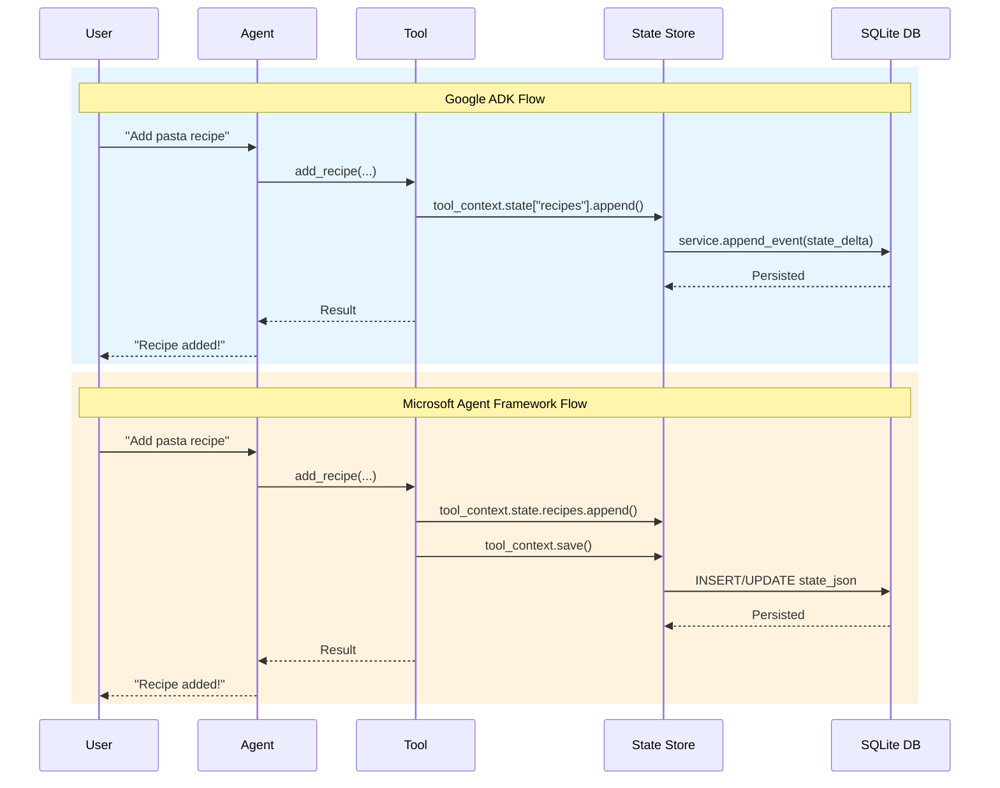

---

## 📊 Detailed Mapping

### Component Mapping

| Google ADK | Microsoft Agent Framework |
|------------|---------------------------|
| `DatabaseSessionService` | `RecipeStateStore` (custom) |
| `session.state` | `RecipeState` dataclass |
| `service.create_session()` | `store.save_state()` (first time) |
| `service.get_session()` | `store.get_state()` |
| `service.list_sessions()` | `store.list_users()` |
| `service.append_event()` | `context.save()` |
| `tool_context.state` | `tool_context.state` (custom class) |
| `Runner` | `RecipeAssistant` (custom class) |
| `runner.run_async()` | `agent.invoke()` |

### Session Management

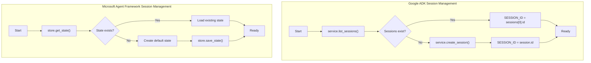

---

## 🔑 Key Differences

### 1. Session/State Service Pattern

**Google ADK** - Built-in service:
```python
from google.adk.sessions import DatabaseSessionService

service = DatabaseSessionService(db_url="sqlite:///./recipe_data.db")

# Create session
session = await service.create_session(
    app_name=APP_NAME,
    user_id=USER_ID,
    state=initial_state,
)

# Get session
session = service.get_session(app_name, user_id, session_id)
```

**Microsoft Agent Framework** - Custom implementation:
```python
class RecipeStateStore:
    def __init__(self, db_path: Path):
        self.db_path = db_path
        self._init_db()
    
    def get_state(self, user_id: str, app_name: str) -> RecipeState:
        # Query SQLite and return state
        ...
    
    def save_state(self, user_id: str, app_name: str, state: RecipeState):
        # Insert/update in SQLite
        ...
```

### 2. State Access in Tools

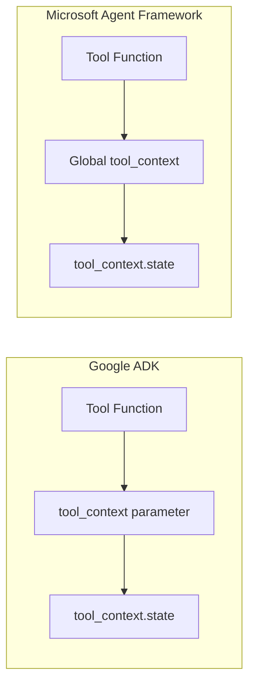

**Google ADK:**
```python
def add_recipe(name: str, tool_context=None) -> dict:
    if tool_context and hasattr(tool_context, "state"):
        recipes = tool_context.state.get("recipes", [])
        recipes.append(recipe)
        tool_context.state["recipes"] = recipes
    return {"message": "Added"}
```

**Microsoft Agent Framework:**
```python
# Global context set before invocation
tool_context: Optional[ToolContext] = None

@tool
def add_recipe(name: str) -> dict:
    global tool_context
    if tool_context:
        tool_context.state.recipes.append(recipe)
        tool_context.save()  # Explicit persistence
    return {"message": "Added"}
```

### 3. State Persistence

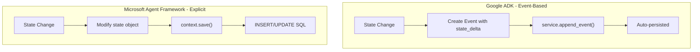

**Google ADK** - Automatic via events:
```python
event = Event(
    id=str(uuid.uuid4()),
    author="user",
    content=types.Content(...),
    actions=session_types.Actions(state_delta={"recipes": recipes}),
    timestamp=time.time(),
)
service.append_event(session=session, event=event)
```

**Microsoft Agent Framework** - Explicit save:
```python
tool_context.state.recipes.append(recipe)
tool_context.save()  # Must call explicitly
```

### 4. Runner Pattern

**Google ADK:**
```python
runner = Runner(
    agent=recipe_agent,
    app_name=APP_NAME,
    session_service=service
)

# Run with streaming events
async for ev in runner.run_async(user_id, session_id, new_message):
    if ev.is_final_response():
        print(ev.content.parts[0].text)
```

**Microsoft Agent Framework:**
```python
class RecipeAssistant:
    def __init__(self, user_id, app_name):
        self.agent = create_recipe_agent()
        self.thread = AgentThread()
        self.context = ToolContext(user_id, app_name, state_store)
    
    async def ask(self, user_input: str) -> str:
        response = await self.agent.invoke(
            input_message=user_input,
            thread=self.thread,
        )
        return response.content
```

---

## 🗄️ Database Schema Comparison

### Google ADK

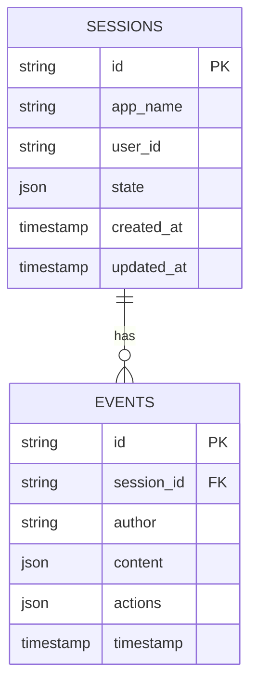

### Microsoft Agent Framework (Custom)

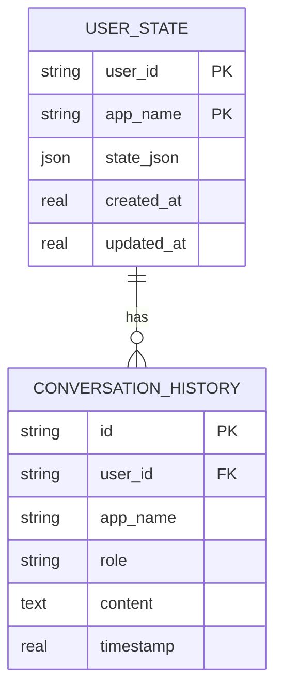

---

## 🏢 Recipe Assistant Components

### Tools Available

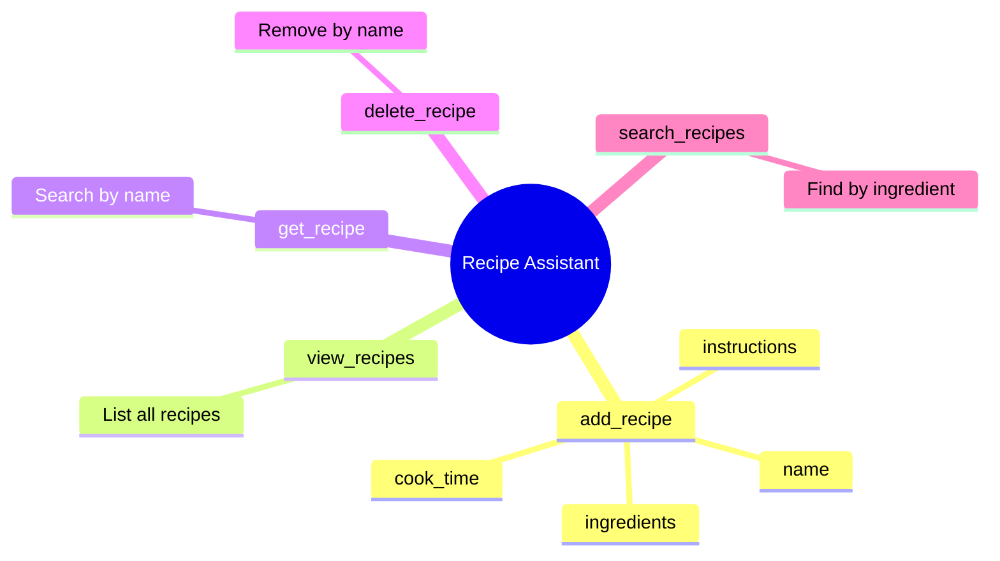

### State Structure

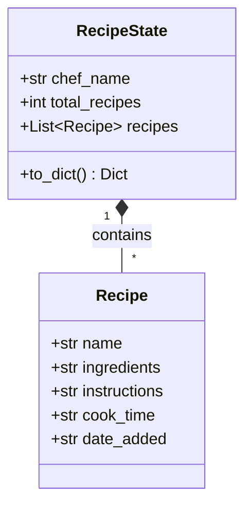

---

## ⚡ Execution Flow

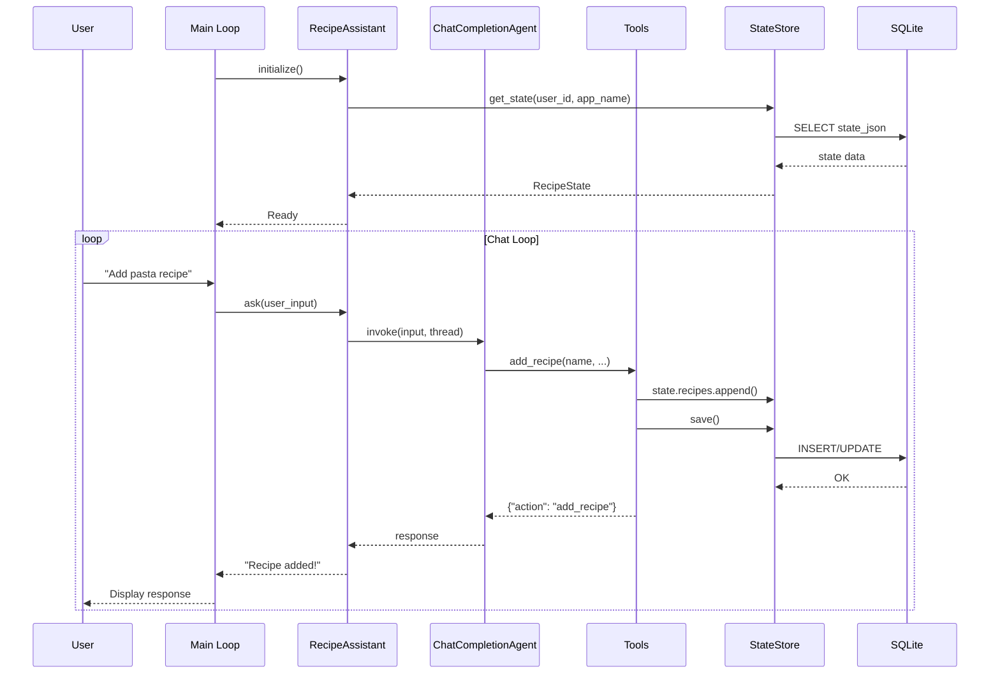

---

## ✅ Advantages & Trade-offs

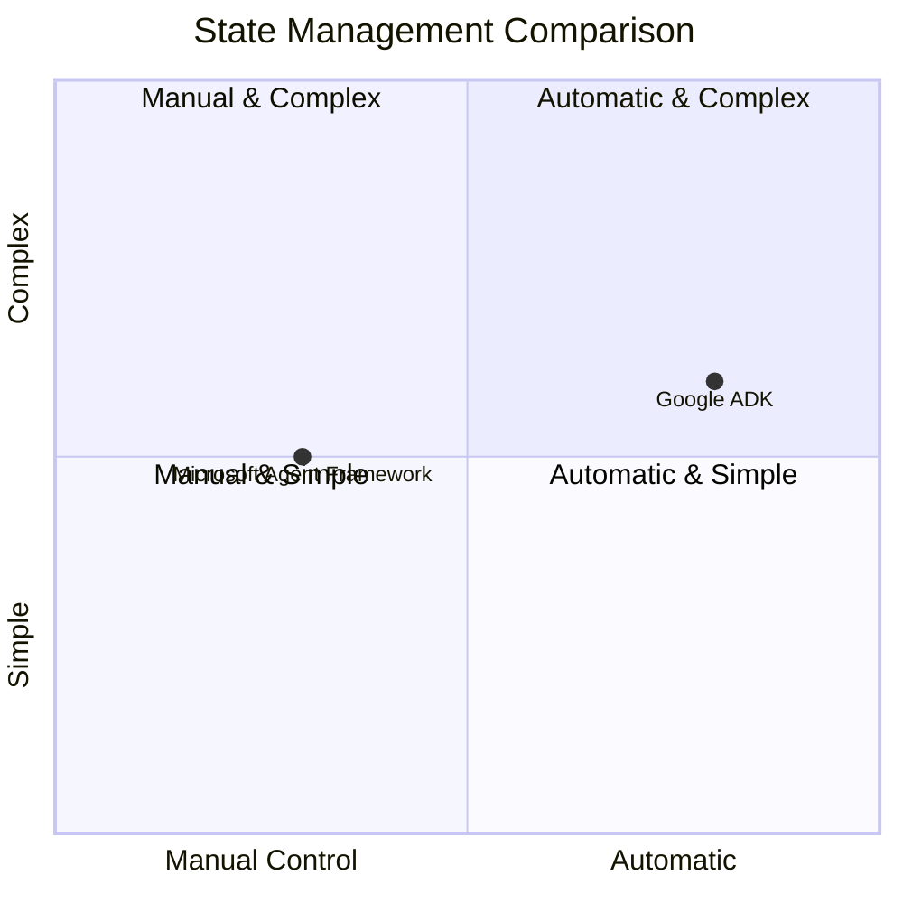

### Google ADK Advantages
- ✅ Built-in `DatabaseSessionService`
- ✅ Automatic state persistence via events
- ✅ Event sourcing pattern built-in
- ✅ Session management handled by framework
- ✅ `tool_context` automatically injected

### Microsoft Agent Framework Advantages
- ✅ Full control over state structure
- ✅ Custom database schema design
- ✅ Explicit persistence (predictable)
- ✅ Flexible state store implementation
- ✅ Can use any database/storage backend
- ✅ Better for complex state requirements

### Trade-offs

| Aspect | Google ADK | Microsoft Agent Framework |
|--------|------------|---------------------------|
| **Built-in Support** | Comprehensive | Minimal (build your own) |
| **Flexibility** | Moderate | High |
| **Boilerplate** | Less | More |
| **Control** | Limited | Full |
| **Event Sourcing** | Built-in | DIY |
| **Schema Control** | Framework-defined | Custom |

---

## 🌐 Environment Configuration

### Google ADK
```bash
GOOGLE_API_KEY=your-google-api-key
```

### Microsoft Agent Framework
```bash
AZURE_OPENAI_ENDPOINT=https://your-resource.openai.azure.com/
AZURE_OPENAI_API_KEY=your-api-key
AZURE_OPENAI_DEPLOYMENT=gpt-4o
```

---

## 📝 Summary

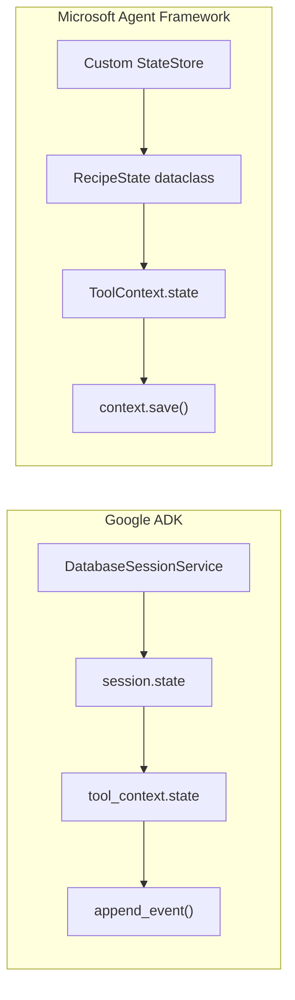

| Feature | Google ADK | Microsoft Agent Framework |
|---------|------------|---------------------------|
| **Session service** | `DatabaseSessionService` | Custom `RecipeStateStore` |
| **State access** | `session.state` dict | `RecipeState` dataclass |
| **Tool context** | Auto-injected `tool_context` | Global `ToolContext` |
| **Persistence** | Event-based (automatic) | Explicit `save()` |
| **Runner** | `Runner` class | Custom `RecipeAssistant` |

The key insight is that Google ADK provides **built-in persistence infrastructure** while Microsoft Agent Framework requires **custom implementation** but offers more flexibility in designing your state management architecture.

---

## 🔗 References

- [Microsoft Agent Framework Overview](https://learn.microsoft.com/en-us/agent-framework/overview/agent-framework-overview)
- [Microsoft Agent Framework Thread Management](https://learn.microsoft.com/en-us/agent-framework/threads)
- [Google ADK Sessions Documentation](https://google.github.io/adk-docs/)

