# Session State Runner Translation Analysis
## Google ADK → Microsoft Agent Framework

This document analyzes the translation of the session-state-runner examples from Google's Agent Development Kit (ADK) to Microsoft's Agent Framework.

---

## 📋 Overview

This folder contains three examples demonstrating session and state management:

| File | Purpose | Key Features |
|------|---------|--------------|
| `agent.py` | Customer support with structured output | `output_schema`, `output_key`, state interpolation |
| `session_object.py` | Session properties demo | Session lifecycle, properties examination |
| `tester.py` | Full Study Buddy app | Persistent state, tools, interactive CLI |

---

## 🏗️ Architecture Comparison

### High-Level Architecture

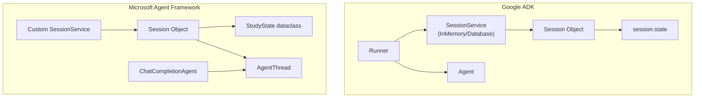

---

## 📊 Detailed Mapping

### Component Mapping

| Google ADK | Microsoft Agent Framework |
|------------|---------------------------|
| `InMemorySessionService` | Custom `InMemorySessionService` class |
| `DatabaseSessionService` | Custom `DatabaseSessionService` class |
| `session.state` | `StudyState` dataclass |
| `session.id` | `session.id` |
| `session.app_name` | `session.app_name` |
| `session.user_id` | `session.user_id` |
| `session.events` | `session.events` / `thread.messages` |
| `session.last_update_time` | `session.last_update_time` |
| `Runner` | Direct `agent.invoke()` |
| `output_schema` | Pydantic model + response parsing |
| `output_key` | Manual state storage |
| `tool_context.state` | Global state access |

---

## 🔄 Session Lifecycle Comparison

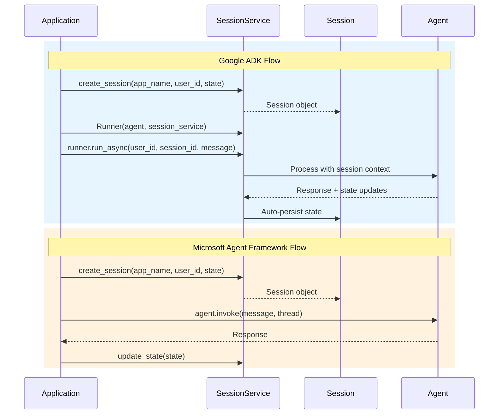

---

## 🔑 Key Differences

### 1. Session Services

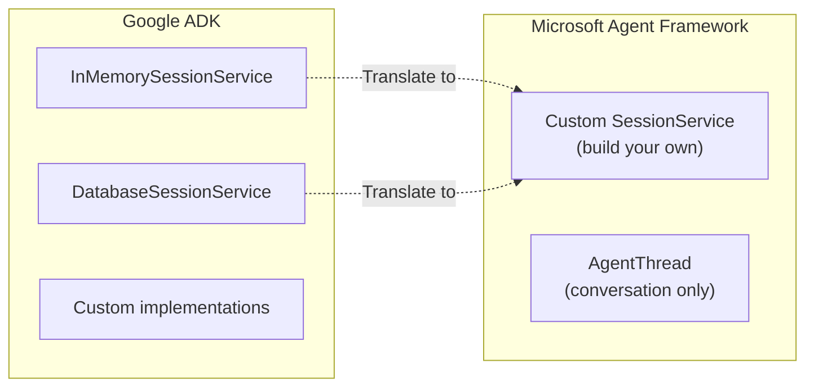

**Google ADK** - Built-in services:
```python
from google.adk.sessions import InMemorySessionService, DatabaseSessionService

# Ready to use
service = InMemorySessionService()
service = DatabaseSessionService(db_url="sqlite:///./data.db")
```

**Microsoft Agent Framework** - Custom implementation:
```python
class InMemorySessionService:
    def __init__(self):
        self._sessions = {}
    
    async def create_session(self, ...): ...
    async def get_session(self, ...): ...
    async def delete_session(self, ...): ...
```

### 2. Structured Output (output_schema)

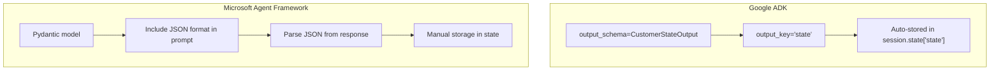

**Google ADK:**
```python
class CustomerStateOutput(BaseModel):
    customer_name: str
    loyalty_points: int

agent = Agent(
    output_schema=CustomerStateOutput,
    output_key="state",  # Auto-stored here
)

# After agent runs:
structured = session.state["state"]  # Automatically populated
```

**Microsoft Agent Framework:**
```python
class CustomerStateOutput(BaseModel):
    customer_name: str
    loyalty_points: int

# Include format in prompt
system_prompt = """
...
Output JSON: {"customer_name": "...", "loyalty_points": ...}
"""

# Parse manually
response = await agent.invoke(message)
json_data = extract_json(response.content)
session.state["state"] = json_data
```

### 3. State Interpolation in Instructions

**Google ADK** - Automatic variable substitution:
```python
agent = Agent(
    instruction="Hello {customer_name}, you have {loyalty_points} points."
)
# Variables auto-filled from session.state
```

**Microsoft Agent Framework** - Manual string formatting:
```python
system_prompt = f"""Hello {state.customer_name}, you have {state.loyalty_points} points."""

agent = ChatCompletionAgent(system_prompt=system_prompt)
```

### 4. Runner vs Direct Invocation

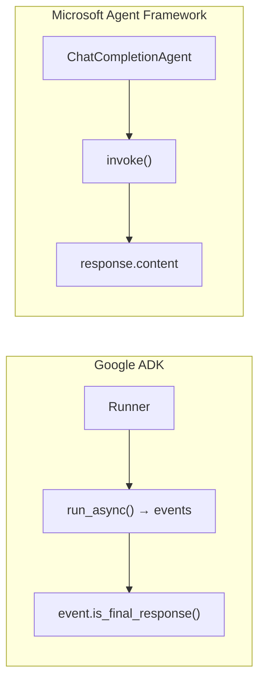

**Google ADK:**
```python
runner = Runner(agent=agent, app_name=APP_NAME, session_service=service)

async for event in runner.run_async(user_id, session_id, message):
    if event.is_final_response():
        print(event.content.parts[0].text)
```

**Microsoft Agent Framework:**
```python
response = await agent.invoke(
    input_message=message,
    thread=thread,
)
print(response.content)
```

### 5. Tool Context State Access

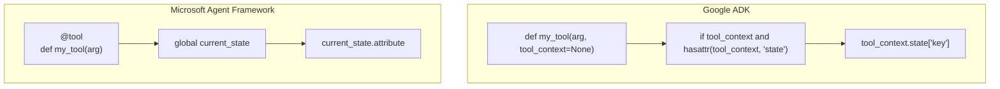

**Google ADK:**
```python
def add_course(name: str, tool_context=None) -> dict:
    if tool_context and hasattr(tool_context, "state"):
        courses = tool_context.state.get("courses", [])
        courses.append({"name": name})
        tool_context.state["courses"] = courses
```

**Microsoft Agent Framework:**
```python
current_state: Optional[StudyState] = None

@tool
def add_course(name: str) -> dict:
    global current_state
    if current_state:
        current_state.courses.append({"name": name})
        asyncio.create_task(_save_state())
```

---

## 🗄️ Study Buddy Data Model

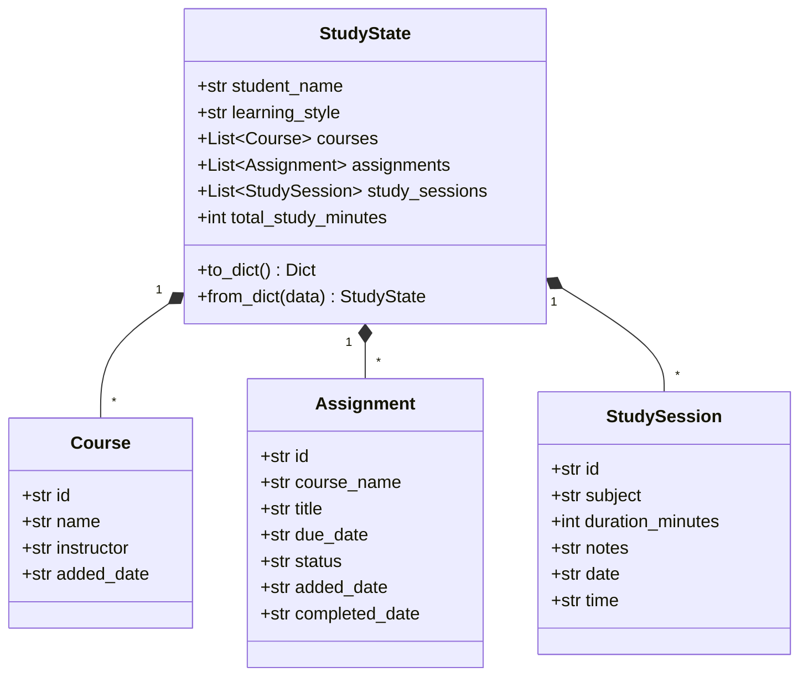

---

## ⚡ Execution Flow - Study Buddy

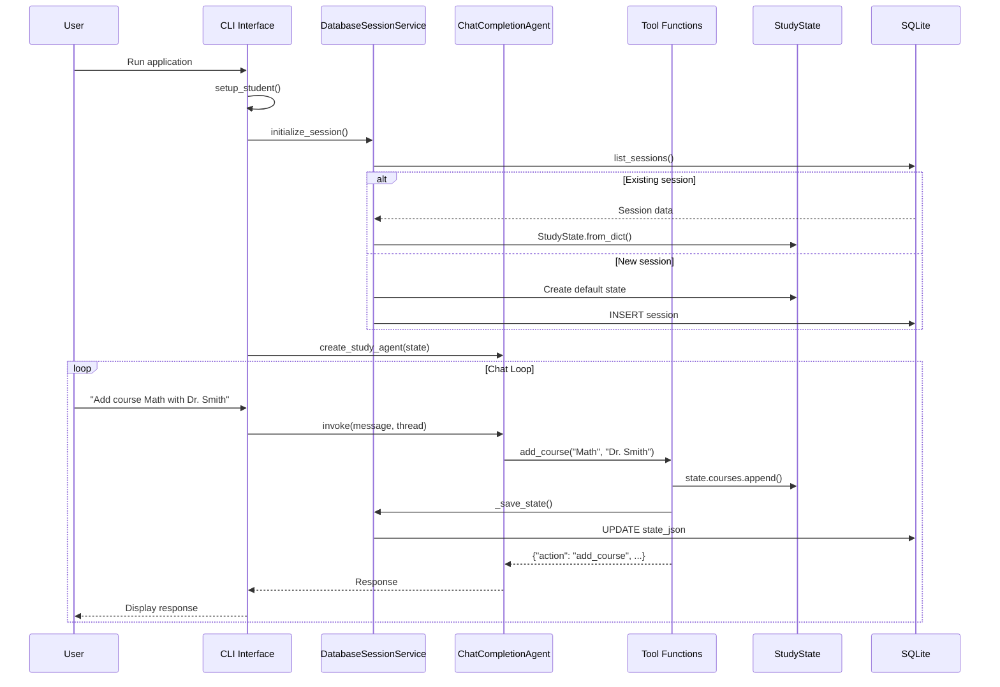

---

## 📁 File-by-File Analysis

### agent.py - Customer Support

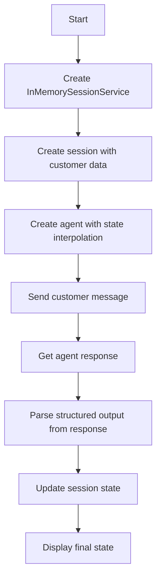

| Feature | Google ADK | Microsoft Agent Framework |
|---------|------------|---------------------------|
| Structured output | `output_schema=Pydantic` | Parse JSON from response |
| State interpolation | `{variable}` in instruction | f-string in system_prompt |
| Auto-storage | `output_key="state"` | Manual `state["state"] = data` |

### session_object.py - Session Properties

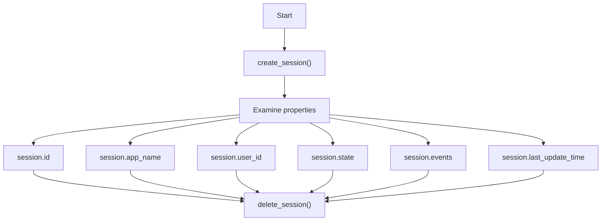

### tester.py - Study Buddy

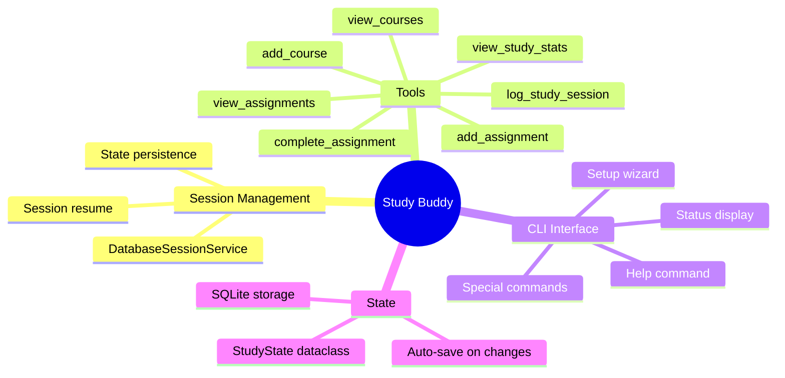

---

## ✅ Advantages & Trade-offs

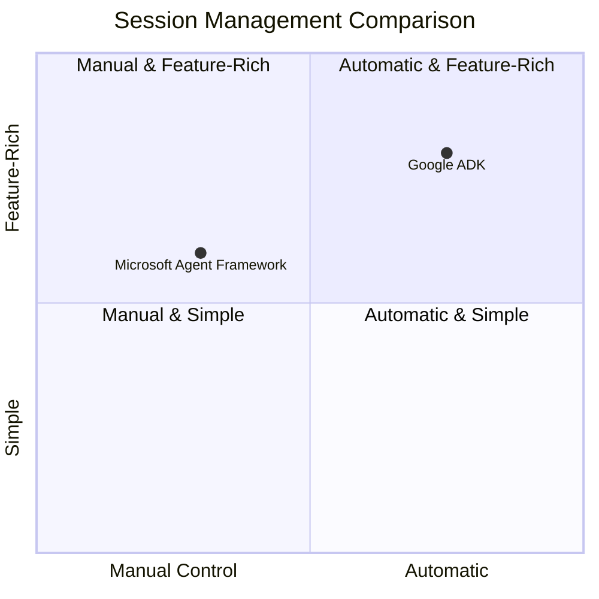

### Google ADK Advantages
- ✅ Built-in `InMemorySessionService` and `DatabaseSessionService`
- ✅ Automatic state interpolation in instructions
- ✅ `output_schema` for structured output
- ✅ `output_key` for automatic state storage
- ✅ Event-based streaming with `run_async()`
- ✅ `tool_context.state` auto-injection

### Microsoft Agent Framework Advantages
- ✅ Full control over session implementation
- ✅ Custom database schema design
- ✅ Flexible state structures (dataclasses)
- ✅ Direct agent invocation (simpler for basic cases)
- ✅ Can use any storage backend
- ✅ More explicit state management

### Trade-offs

| Aspect | Google ADK | Microsoft Agent Framework |
|--------|------------|---------------------------|
| **Session services** | Built-in | DIY |
| **Structured output** | Automatic | Manual parsing |
| **State interpolation** | `{variable}` | f-strings |
| **Tool context** | Auto-injected | Global state |
| **Streaming** | Event-based | Response object |
| **Boilerplate** | Less | More |

---

## 🌐 Environment Configuration

### Google ADK
```bash
GOOGLE_API_KEY=your-google-api-key
```

### Microsoft Agent Framework
```bash
AZURE_OPENAI_ENDPOINT=https://your-resource.openai.azure.com/
AZURE_OPENAI_API_KEY=your-api-key
AZURE_OPENAI_DEPLOYMENT=gpt-4o
```

---

## 📝 Summary

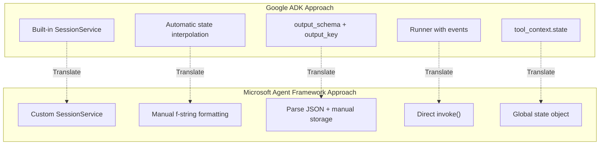

The key insight is that Google ADK provides **comprehensive built-in session management** while Microsoft Agent Framework requires **custom implementation** but offers complete flexibility in designing your session and state architecture.

---

## 🔗 References

- [Microsoft Agent Framework Overview](https://learn.microsoft.com/en-us/agent-framework/overview/agent-framework-overview)
- [Microsoft Agent Framework Thread Management](https://learn.microsoft.com/en-us/agent-framework/threads)
- [Google ADK Sessions Documentation](https://google.github.io/adk-docs/)
- [Pydantic Documentation](https://docs.pydantic.dev/)

